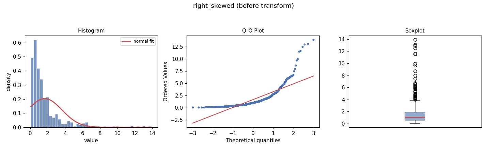
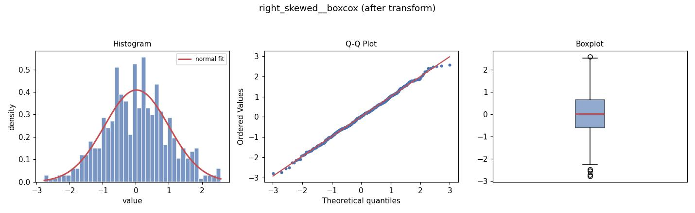

# data-trance


*Put your data in a different state before you transform it.*

`data-trance` is a config-driven pipeline that looks at a column before
touching it: it detects the variable's type, runs the diagnostics (skew,
kurtosis, a normality test, and a 3-panel distribution plot), recommends a
transform, applies it, and then validates that the transform actually
helped — all from one YAML file.

> **Note on install:** this isn't on PyPI yet — install from source with
> `pip install -e .` (see below). Requires Python 3.9+.

It exists because "just log it" is bad advice more often than people admit.
The recommendation step deliberately does **not** just chase the lowest
skew/kurtosis score: rank-based transforms can force near-perfect normality
by construction (they only preserve order, not real distances), so a naive
score comparison would pick them every time — even when the raw data was
already fine, or a simple `log`/`sqrt`/Box-Cox would have done the job with
far less cost to interpretability. `data-trance` prefers, in order: no
transform (if the data's already adequate) → an interpretable parametric
transform that actually normalizes the data → the best partial parametric
improvement available → a rank/quantile fallback, only as a last resort,
with an explicit note about what you're trading away.

**How this differs from calling `scipy.stats.boxcox` or
`sklearn.preprocessing.PowerTransformer` yourself:** those give you one
transform family each, and neither one tells you whether you needed a
transform at all, or whether a different family (arcsine for a proportion,
Anscombe for a count, Fisher's z for a correlation) would have served the
data better. `data-trance` sits a layer above them — it decides *which*
transform (from ~15 candidates spanning several families, including
Box-Cox and Yeo-Johnson under the hood) fits *this* column's type and
shape, applies it, and then checks its own work.

## Example output

Running the pipeline on a right-skewed column produces a before/after pair
like this (from `examples/sample_dataset.csv`, taken straight from a real
run — not a mockup):

| Before (`right_skewed`) | After (`right_skewed__boxcox`) |
|---|---|
|  |  |

...and the corresponding excerpt from `report.md`:

```markdown
## `right_skewed`
**Type:** continuous (numeric, real-valued, not obviously bounded)

- n = 500, mean = 1.666, skew = 3.070, excess kurtosis = 12.072
- normality (Shapiro-Wilk): p = 0.0000

**Recommended transform:** boxcox (parametric_normalizes)
- after: skew = 0.001, excess kurtosis = -0.118, improved = True
```

## Install

```bash
pip install -e .              # base install
pip install -e ".[dl]"        # + PyTorch, for the dl recommender method
# or, without installing the package:
pip install -r requirements.txt
```

## Quickstart

```bash
data-trance run config.example.yaml
```

This runs all six steps against `examples/sample_dataset.csv` and writes
everything to `results/`:

```
results/
├── transformed.csv       # your original columns + new <col>__<transform> columns
├── report.md             # human-readable report with embedded before/after plots
├── summary.json          # machine-readable summary
├── detect_type.json      # per-step intermediate output (one per step)
├── assess.json
├── recommend.json
├── apply_transform.json
├── validate.json
└── plots/
    ├── <col>__before.jpg
    └── <col>__after.jpg
```

## Config

```yaml
input: examples/sample_dataset.csv
output_dir: results
alpha: 0.05                 # significance level for the normality test

columns:
  price:
    type: auto               # let data-trance guess (see "Type detection" below)
  click_rate:
    type: proportion         # forces the arcsine/logit/probit candidate family
  rating:
    type: ordinal             # skips distribution stats; recommends an *encoding*
                              # (ordinal-preserving), not a distribution transform
  region:
    type: categorical         # recommends one-hot / target-encoding / hashing
                              # depending on cardinality — see docs/steps.md
    # transform: log         # optional: force a specific transform instead of
                              # letting `recommend` search for one

steps: [detect_type, assess, recommend, apply_transform, validate, report]
```

See [`docs/config_reference.md`](docs/config_reference.md) for every key.

### Type detection: what happens if it guesses wrong?

`detect_type` guesses from the data's range, boundedness, and integer-ness
(see `docs/steps.md` for the exact rules) — it's a heuristic, not magic,
and it can be wrong for edge cases like a 1-5 Likert rating stored as
integers (looks like `count`, is really `ordinal`) or a percentage stored
as 0-100 instead of 0-1 (looks `continuous`, is really `proportion`).

You don't have to guess whether it got it right: every column's guess and
its reasoning are written to `detect_type.json` and echoed in `report.md`
(e.g. *"all values in [0, 1], not all whole numbers"*). If the reasoning
looks off, add an explicit `type:` for that column in the config — no
other step needs to change.

## recommend_method: rule_based | ml | dl

By default the `recommend` step uses the rule-based candidate search
described above — it applies every relevant transform to the actual data
and measures the result, which is precise but means one full pass over the
candidate list per column.

Set `recommend_method: ml` (or `dl`) to swap in a trained model that
predicts a transform from 16 cheap summary features (skew, kurtosis, n,
boundedness, normality p-value, ...) instead. This trades a little
precision for a lot of speed once you're predicting across many columns at
once — benchmarked on 500 synthetic columns, batched `ml` prediction took
**0.57s total (1.1 ms/column) versus 14.7s (29 ms/column) for the looped
rule-based search — a 25.8x speedup**, and that gap widens further as
column count grows, since the rule-based path scales linearly while the
batched model call barely grows at all.

**When to reach for which:**
- **`rule_based` (default)** — a typical tabular dataset, tens of columns.
  The extra precision is free at this scale; no reason to give it up.
- **`ml` / `dl`** — you're predicting across hundreds or thousands of
  columns (or, looking ahead, voxels in an MRI volume) where re-running
  the full candidate search per column isn't practical. This is the
  actual reason this feature exists — see `docs/ml_recommender.md`.

```yaml
recommend_method: ml     # or: dl
ml_min_confidence: 0.5   # below this confidence, fall back to the rule-based search
```

- **`ml`** — a scikit-learn RandomForest, trained on ~4000 synthetic
  columns (drawn from normal, lognormal, gamma, beta, Poisson, mixture,
  and other distribution families) labeled with whatever the rule-based
  search would have chosen. ~82% test accuracy across 13 transform classes.
- **`dl`** — a small PyTorch MLP trained the same way. Requires the `[dl]`
  extra (`pip install -e ".[dl]"`); if torch isn't installed, or if the
  model's top prediction is below `ml_min_confidence`, the pipeline falls
  back to the rule-based search automatically and records why in the
  `reason` field (e.g. `already_adequate(ml_low_confidence=0.31)` or
  `parametric_normalizes(ml_unavailable)`) — it never silently trusts a
  low-confidence guess or crashes because torch is missing. Currently
  ~64% test accuracy — meaningfully weaker than the RandomForest; it's
  included as a second independently-trained model and as infrastructure
  for future work, not because it's the better choice today.

Both models predict from the same fixed 16-feature vector — see
`data_trance/ml/features.py`. To retrain on more/different synthetic data:

```bash
data-trance train-recommender --n-samples 8000
```

See [`docs/ml_recommender.md`](docs/ml_recommender.md) for the full design
writeup, including where the training labels come from (there's no
external ground-truth dataset — see the doc for how that's handled).

## Running one step at a time

Every step reads what it needs from the previous steps' JSON output on
disk if it isn't already in memory, so each step is runnable on its own —
useful for inspecting or re-running just one part of the pipeline:

```bash
data-trance step detect_type config.example.yaml
data-trance step assess config.example.yaml
data-trance step recommend config.example.yaml
```

If a step's dependency hasn't been run yet, you get a clear error telling
you which step to run first, rather than a crash.

See [`docs/steps.md`](docs/steps.md) for what each step does and produces.

## What's actually going on under the hood

- **detect_type** — guesses `continuous` / `count` / `proportion` /
  `correlation` / `categorical` / `ordinal` from the data's range,
  boundedness, and integer-ness, or uses your override from the config.
- **assess** — descriptive stats, skewness, excess kurtosis, a normality
  test (Shapiro-Wilk or D'Agostino-Pearson depending on sample size), and a
  histogram+Q-Q+boxplot panel per numeric column. Categorical columns get
  cardinality stats instead.
- **recommend** — searches a shortlist of transforms appropriate to the
  column's type and actual range (won't try `log` on negative values, won't
  try `arcsine_sqrt` outside [0,1]), then applies the preference order
  described above. Categorical columns get an encoding recommendation
  (binary / one-hot / target-or-frequency / hashing) based on cardinality.
- **apply_transform** — applies the recommended (or overridden) transform,
  writes `<col>__<transform>` as a new column, leaves the original intact.
- **validate** — re-runs the diagnostics on the transformed column and
  produces a matching after-plot, so you can see the before/after side by
  side and confirm the transform actually helped.
- **report** — assembles everything into one Markdown report with embedded
  plots, plus a machine-readable `summary.json`.

## Development / contributing

```bash
pip install -e ".[dev]"
pytest
```

This is a young, small project — issues and PRs are welcome, especially
around the candidate-transform shortlists in `recommend.py` and the ML
feature set. If you're proposing a new transform or a change to the
recommendation logic, a test showing it choosing correctly on a synthetic
example (see `tests/test_recommend.py`) makes the change much easier to
review than a description alone. No formal RFC process for something this
size — open an issue first for anything larger than a bug fix.

## Roadmap

Voxel-wise / MRI-VBM support is the next planned extension — using the
`ml`/`dl` recommenders' batch-prediction speed to make per-voxel transform
recommendation tractable at the scale a brain volume requires. Not
implemented yet.

## License

MIT
